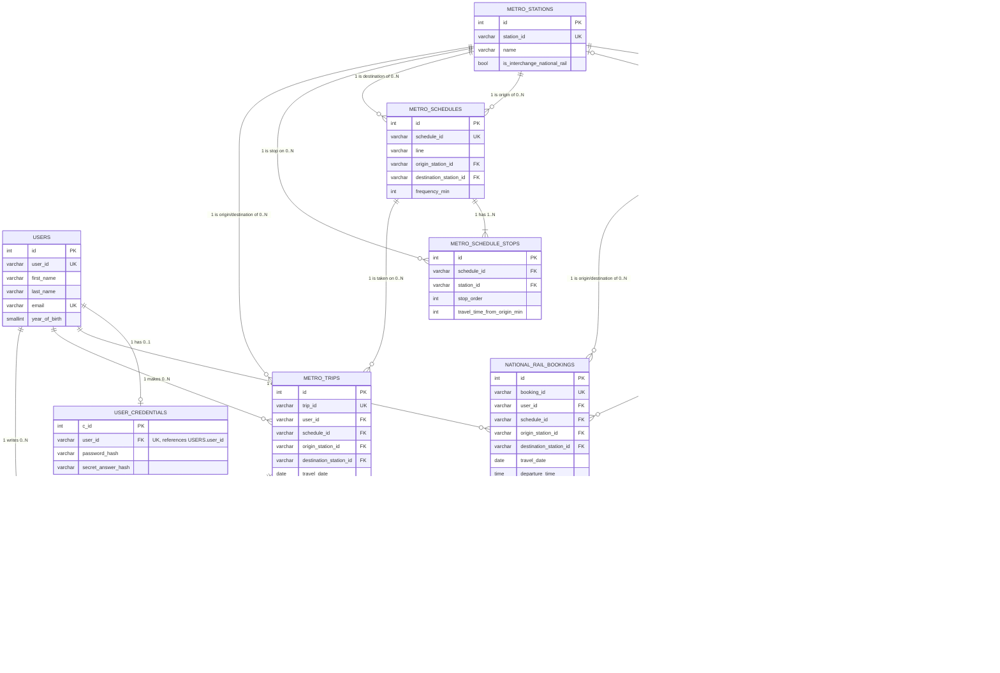

# TransitFlow — Database Design Document

This document covers the full database design for the TransitFlow project: the
relational schema (PostgreSQL), the graph model (Neo4j), the vector / RAG layer
(pgvector), AI tool usage evidence, design reflection, and the Task 6 optional
extension (Section 7).

| | |
|---|---|
| **Relational schema** | `databases/relational/schema.sql` |
| **Relational queries** | `databases/relational/queries.py` |
| **Graph seed / queries** | `skeleton/seed_neo4j.py`, `databases/graph/queries.py` |
| **Vector seed / queries** | `skeleton/seed_vectors.py`, `query_policy_vector_search` |
| **Task 6 file manifest** | `TASK6.md` (repo root) |

---

## Section 1 — Entity-Relationship Diagram

The diagram below covers all 15 relational tables in `databases/relational/schema.sql`
(the scaffolded `policy_documents` table for the vector/RAG layer is excluded, per the
assignment instructions).

**PK convention:** every table uses a surrogate `SERIAL` primary key (named `id`
everywhere except `user_credentials`, where it is `c_id`) for internal row identity. The original business identifier (`user_id`, `station_id`,
`schedule_id`, `booking_id`, ...) is kept as `UNIQUE NOT NULL` and is the column used
by every foreign key and by application code (`queries.py`). See Section 2 and
Section 6 for the rationale.



**Notes on cardinality:**
- `users` ↔ `user_credentials` is 1:0..1 — every user *should* have exactly one
  credential record, but the FK is nullable-by-absence (no row until registration
  completes), so it is modelled as optional.
- `payments` has two mutually-exclusive nullable FKs (`national_rail_booking_id`,
  `metro_trip_id`) — a single payment row pays for either a rail booking *or* a metro
  trip, never both. This is the "separate nullable FKs" polymorphic pattern (see
  Section 2). `feedback` uses the same pattern. Both rules are enforced at the
  database level: `CHECK (num_nonnulls(national_rail_booking_id, metro_trip_id) = 1)`
  guarantees exactly one target is populated (never both, never neither), and a
  `UNIQUE` constraint on each payments FK guarantees at most one payment per
  booking/trip — which is what makes the 0..1 cardinality drawn above a real schema
  property rather than an application convention (PostgreSQL `UNIQUE` ignores NULLs,
  so the many NULL rows on each side do not collide). `feedback` carries the same
  XOR `CHECK` and, like `payments`, a `UNIQUE` constraint on each FK — enforcing
  at most one feedback row per booking/trip (0..1). `execute_submit_feedback` uses
  `ON CONFLICT … DO UPDATE` (upsert) so a repeat submission updates the existing
  rating and comment rather than inserting a duplicate; the returned `feedback_id`
  is always the canonical ID of the surviving row.
- The metro↔rail interchange pairing (`metro_stations.interchange_national_rail_station_id`
  / `national_rail_stations.interchange_metro_station_id`) is drawn as 0..1 ↔ 0..1
  above but is deliberately **not** declared as FK constraints in the schema: the two
  station tables would reference each other circularly, complicating creation and
  seeding order, and the relationship is never joined on in SQL — it is the source
  data for the Neo4j `INTERCHANGE_TO` edges, which is where interchange traversal is
  actually queried (Section 3).
- Station tables have **two** relationships into each schedule table
  (`origin_station_id` and `destination_station_id`), each 1:N — both are drawn
  separately above since they represent different real-world roles.

---

## Section 2 — Normalisation Justification

### 2.1 Normalisation decision: schedule stops in a junction table (3NF)

`metro_schedules` and `national_rail_schedules` each represent one route between an
origin and a destination. Every route passes through an ordered sequence of
intermediate stations, and each stop has its own `stop_order` and
`travel_time_from_origin_min`.

A naive design would store this sequence as a single array/JSONB column on the
schedule row, e.g. `stops_in_order: ["NR01", "NR02", "NR03"]`. This violates **1NF**
(the column is not atomic — it hides a repeating group of `(station_id, stop_order,
travel_time)` tuples inside one cell) and makes it impossible for the database to
enforce that `(schedule_id, station_id)` is unique, or to query "which schedules pass
through station X" without a JSON scan.

Instead, `metro_schedule_stops` and `national_rail_schedule_stops` are separate
junction tables:

```sql
CREATE TABLE national_rail_schedule_stops (
    id SERIAL PRIMARY KEY,
    schedule_id VARCHAR(20) REFERENCES national_rail_schedules(schedule_id) ON DELETE CASCADE,
    station_id  VARCHAR(20) REFERENCES national_rail_stations(station_id) ON DELETE RESTRICT,
    stop_order INTEGER NOT NULL,
    travel_time_from_origin_min INTEGER NOT NULL,
    deleted_at TIMESTAMPTZ,
    UNIQUE(schedule_id, station_id)
);
```

This achieves **3NF**: the candidate key of the table is the composite
`(schedule_id, station_id)`, and every non-key attribute (`stop_order`,
`travel_time_from_origin_min`) is functionally dependent on that whole composite key
— there is no partial dependency on either component of the key: `schedule_id` alone
cannot determine `stop_order` (one schedule has many stops, each with a different
order), and `station_id` alone cannot either (the same station has a different order
and travel time on every schedule that serves it) — and there is no transitive
dependency through another non-key attribute. This decision directly supports the route-order queries used by
`query_metro_schedules` / `query_national_rail_availability`, which join the stops
table twice (as `orig` and `dest`) and compare `orig.stop_order < dest.stop_order` —
a comparison the database can index and the JSON design cannot.

### 2.2 Deliberate de-normalisation: JSONB for non-queried, schedule-attached data

Several columns are deliberately kept as `JSONB` rather than normalised into their
own tables: `operates_on` (days of week), `fare_classes` (national rail),
`passed_through_stations` (express services only), and `coaches` (seat layout).

**Why this is *not* a normalisation violation in spirit:** normalisation rules apply
to data that represents independent entities with their own identity, queried and
updated on their own. `operates_on` is a small, fixed-size, schedule-attached list
(`["mon","tue",...]`). It *is* filtered on — `query_national_rail_availability`
applies `s.operates_on ? 'mon'` to keep only schedules operating on the requested
day, and `execute_booking` re-validates the same rule — but the JSONB `?`
containment operator answers that predicate directly on the schedule row, with no
join and (at this scale: 8 national-rail schedule rows) no index needed; a normalised
`schedule_operating_days` junction table would add a join to every availability
query for no measurable benefit. `fare_classes` is schedule-scoped: every fare lookup already has the
`schedule_id` and extracts one nested object from one row. `coaches` is a nested
document (coach → fare_class → seat list) that is always retrieved and rendered as a
whole (seat picker); splitting it into `coaches` / `seats` tables would add joins to
every availability query for a structure that is never updated independently of its
parent `national_rail_seat_layouts` row.

**Trade-off accepted:** we cannot use a `UNIQUE` constraint or FK to validate
individual entries inside the JSONB blob (e.g. nothing stops `operates_on` containing
`"funday"`), and querying "all schedules running on Saturday" requires a JSONB
containment operator (`operates_on ? 'sat'`) rather than a join. We judged this
acceptable because (a) the values are written once at seed time from a fixed
vocabulary, not user-editable, and (b) the data is genuinely document-shaped
(variable-length, nested, never the target of its own FK) — a deliberate choice to
favour simplicity over strict normalisation for data that behaves like configuration,
not like an entity.

### 2.3 Password hashing: argon2id

`user_credentials.password_hash` stores an **argon2id** hash via `register_user()` /
`login_user()` (not MD5, SHA-1, or unsalted SHA-256). The secret-question answer is
hashed the same way (`secret_answer_hash`), lower-cased before hashing so
`verify_secret_answer` can compare case-insensitively.

**Why argon2id over MD5/SHA-1:** MD5 and SHA-1 are fast, general-purpose digest
functions — an attacker with a stolen `password_hash` column can compute billions of
candidate hashes per second on commodity GPUs, making brute-force/dictionary attacks
on user passwords cheap. argon2id is a **memory-hard, key-stretching** function: it
deliberately requires a configurable amount of memory and CPU time per hash
computation (its cost factor: memory cost `m`, iterations `t`, parallelism `p`),
which scales linearly with attacker effort — computing the same number of guesses
becomes orders of magnitude slower and memory-bound, which is far harder to
parallelise on GPUs/ASICs than MD5/SHA-1. argon2id specifically combines argon2i's
resistance to side-channel attacks with argon2d's resistance to GPU cracking, and is
the OWASP-recommended default for new systems.

**How salt is managed:** argon2id generates a fresh cryptographically-secure random
salt (CSPRNG) for every call to the hash function and embeds it directly in the
returned hash string in MCF format (e.g.
`$argon2id$v=19$m=65536,t=3,p=4$<salt>$<hash>`). This is why `user_credentials` has
**no separate `salt` column** — it would be redundant. The practical consequence: if
two users both choose the password `"password123"`, their `password_hash` values will
be completely different, because each was hashed with an independent random salt.
This defeats precomputed **rainbow-table** attacks, which rely on attacking many
accounts with one shared table of hash→password lookups — with per-user salts, an
attacker would need a separate table per salt, which is computationally infeasible.

### 2.4 Terminology summary

- **Candidate key:** for `national_rail_schedule_stops`, `(schedule_id, station_id)` is
  the candidate key enforced via `UNIQUE(schedule_id, station_id)`; `id` is the chosen
  surrogate primary key.
- **Functional dependency:** `stop_order`, `travel_time_from_origin_min` →
  `(schedule_id, station_id)` — both attributes are fully determined by the composite
  candidate key, with no partial dependency on either column alone.
- **Transitive dependency (avoided):** none of the normalised tables have a non-key
  attribute that depends on another non-key attribute rather than the key directly —
  e.g. `national_rail_bookings.amount_usd` is computed and stored at booking time from
  `fare_class`/`stops_travelled` via `execute_booking`, not derived through another
  column at query time, so there is no hidden transitive dependency through
  `schedule_id`.
- **1NF/2NF/3NF:** Section 2.1 walks through how the schedule-stops design satisfies
  1NF (atomic columns, no repeating groups), 2NF (no partial dependency on part of a
  composite key), and 3NF (no transitive dependency between non-key attributes).

---

## Section 3 — Graph Database Design Rationale

### 3.1 What is stored as nodes, relationships, and properties — and why

**Nodes — stations.** The graph contains two node labels: `MetroStation` (20 nodes,
MS01–MS20) and `NationalRailStation` (10 nodes, NR01–NR10). Stations are nodes
because they are the *positions* a route-finding algorithm visits: every routing
question ("fastest from A to B", "what is affected if X closes") is a question about
moving between stations. We use two specific labels instead of one generic `Station`
label so that same-network queries can constrain the search space up-front
(`MATCH (start:MetroStation ...)`) — a metro-only route should never even consider
rail nodes. Cross-network queries simply match on `station_id` without a label.

**Relationships — physical adjacency.** Three relationship types model the three
physically different kinds of connection:

| Relationship | Connects | Properties |
|---|---|---|
| `METRO_LINK` | adjacent metro stations | `line`, `travel_time_min`, `cost_usd` |
| `RAIL_LINK` | adjacent rail stations | `line`, `travel_time_min`, `cost_standard_usd`, `cost_first_usd` |
| `INTERCHANGE_TO` | a metro station ↔ its paired rail station (created in both directions) | `travel_time_min: 5` |

Adjacency is a relationship (not a node or a property) because it is exactly what a
traversal follows: Dijkstra repeatedly expands the cheapest *edge* out of the
frontier. Keeping the three types separate lets each query restrict traversal by
relationship type (`'METRO_LINK>'`, `'RAIL_LINK>'`, or the union
`'METRO_LINK>|RAIL_LINK>|INTERCHANGE_TO>'`) instead of filtering every expanded edge
with a `WHERE` clause — the type filter is applied during expansion, which prunes the
search tree rather than the result set.

**Properties — weights the algorithms read.** Two design decisions matter here:

1. *One unified time property.* `INTERCHANGE_TO` carries `travel_time_min` (the
   5-minute transfer walk) under the **same property name** as the link types, so
   `apoc.algo.dijkstra(start, end, ..., 'travel_time_min')` and
   `reduce(total=0, rel IN relationships(path) | total + rel.travel_time_min)` can
   sum a single property across heterogeneous edges. (We originally considered a
   separate `transfer_time_min` and rejected it — see Section 5, Example 4.)
2. *Pre-computed fares as edge weights.* `query_cheapest_route` needs cost-weighted
   Dijkstra, but fares in the relational model are formula-based
   (`base + per_stop × stops`), which a graph traversal cannot evaluate per-path.
   `seed_neo4j.py` therefore pre-computes per-segment costs from
   `metro_schedules.json` / `national_rail_schedules.json` at seed time and stores
   them on the edges (`cost_usd` for metro; `cost_standard_usd` / `cost_first_usd`
   for rail). The `fare_class` parameter then simply selects which property name
   Dijkstra minimises — which is how `fare_class` visibly changes both the weight
   and, potentially, the chosen path.

### 3.2 Why a graph database beats SQL for these workloads

The honest argument is algorithmic, not "graphs are faster":

- **Weighted shortest path.** Neo4j's APOC `dijkstra` runs the classic priority-queue
  algorithm (`O(E + V log V)`) directly over index-free adjacency: each node holds
  physical pointers to its relationships, so expanding a frontier node is a pointer
  dereference, not an index lookup. Expressing the same thing in PostgreSQL requires
  a **recursive CTE** (`WITH RECURSIVE`) that (a) joins the edge table against the
  growing frontier on every iteration, (b) must carry an accumulated path array in
  every row purely to detect cycles, and (c) has no priority queue — it cannot
  "expand cheapest first", so it effectively enumerates *all* simple paths up to a
  depth bound and then sorts, which is exponential in path length. For a 30-node
  network this is survivable; the point is that the graph formulation stays the same
  algorithm at 30 or 30,000 nodes, while the SQL formulation degrades by design.
- **Delay ripple (k-hop neighbourhood).** "All stations within N hops of NR03" is a
  bounded breadth-first expansion — one line of
  `apoc.path.expandConfig(start, {minLevel: 1, maxLevel: $hops})`. In SQL this is
  again a recursive CTE with explicit visited-set bookkeeping, and "hops" has no
  native meaning — it must be reconstructed from the recursion depth.
- **What the graph deliberately does *not* store:** bookings, seats, users, payments.
  Those need ACID transactions, uniqueness constraints, and aggregation — exactly
  what PostgreSQL does well and a property graph does not. The two databases share
  only the `station_id` vocabulary.

### 3.3 Two query types the model enables

**Fastest route — `query_shortest_route(origin, destination, network)`.**
Same-network case: the node label and relationship type are chosen from the ID prefix
(`MS…` → `MetroStation`/`METRO_LINK`) and the query is one APOC call:

```cypher
MATCH (start:NationalRailStation {station_id: $origin_id})
MATCH (end:NationalRailStation {station_id: $destination_id})
CALL apoc.algo.dijkstra(start, end, 'RAIL_LINK>', 'travel_time_min')
YIELD path, weight
RETURN path, weight
```

The node/relationship structure is what makes this expressible: because adjacency is
an edge with a numeric weight, "fastest" is just "minimise the sum of one edge
property along a path". The function returns `{found, path, legs, total_time_min}`,
where `legs` is rebuilt from `path.relationships` (line + per-segment time).

**Cross-network interchange path — `query_interchange_path(origin, destination)`.**
This is the query that justifies modelling interchanges as *edges* rather than as a
boolean flag on nodes: the path from a metro origin to a rail destination must
physically pass through an `INTERCHANGE_TO` edge, so the query enumerates simple
paths over all three relationship types and keeps the time-minimal one that crosses
the boundary exactly once:

```cypher
CALL apoc.algo.allSimplePaths(start, end, 'METRO_LINK>|RAIL_LINK>|INTERCHANGE_TO>', 20)
YIELD path
WHERE size([r IN relationships(path) WHERE type(r) = 'INTERCHANGE_TO']) = 1
RETURN path, reduce(total=0, rel IN relationships(path) | total + rel.travel_time_min) AS weight
ORDER BY weight ASC LIMIT 1
```

A relational schema has no natural equivalent of "the path contains exactly one edge
of type X" — it would require tagging edge types in the recursive CTE's accumulator.

Two further query types follow the same patterns: `query_delay_ripple` (bounded BFS
via `expandConfig`, returning `hops_away` = path length) and
`query_alternative_routes` (simple-path enumeration that filters out any path whose
node sequence contains the avoided station, deduplicating by station sequence and
respecting `max_routes`).

### 3.4 Node identity

`station_id` (`MS01`–`MS20`, `NR01`–`NR10`) is the identity property on every node:
all `MERGE`s in `seed_neo4j.py` match on it, and every query function takes it as the
parameter. It was chosen because it is (a) the same business identifier used by the
PostgreSQL schema and the agent's tool parameters, so a station means the same thing
in all three databases and no translation layer is needed; (b) stable — names like
"Old Town Junction" could be reworded, the ID cannot; and (c) prefix-coded, which the
query layer exploits to infer the network (`MS` vs `NR`) and pick labels/relationship
types without an extra parameter. `MERGE (n:MetroStation {station_id: $id})` also
makes re-seeding idempotent: matching on the identity property updates rather than
duplicates.

---

## Section 4 — Vector / RAG Design

### 4.1 What is embedded, and why cosine similarity

**What:** the four policy JSON files are split into **13 policy documents** by
`skeleton/seed_vectors.py` — one document per refund policy entry
(`refund_policy.json`, e.g. RF001–RF005), one per ticket type
(`ticket_types.json`), one per network section of `booking_rules.json`
(national_rail / metro / general_rules), and one per network section of
`travel_policies.json`. Each document's JSON content is serialised to text, embedded,
and stored in `policy_documents (title, category, content, embedding, source_file)`.
Documents are deliberately *small and self-contained* (one policy = one vector) so
that a retrieved chunk is precise enough to quote rule IDs (e.g. "RF005: 30–59
minutes → 50% refund") without dragging in unrelated policies.

**Why cosine similarity:** embeddings place texts in a high-dimensional space where
*direction* encodes meaning. Cosine similarity measures the angle between two
vectors and is **magnitude-independent**: a long, verbose policy document and a
short user question produce vectors of very different lengths (norms), but if they
are about the same topic they point in a similar direction. Euclidean distance would
penalise that length difference; cosine does not — which is exactly the property we
want when matching a 10-word question against a 400-word policy. Operationally,
pgvector's `<=>` operator computes cosine *distance*, so the code uses
`1 - (embedding <=> query)` as the similarity score, keeps results above a 0.5
threshold (`VECTOR_SIMILARITY_THRESHOLD`), and the HNSW index is built with
`vector_cosine_ops` so the search is approximate-nearest-neighbour rather than a
full table scan.

### 4.2 The full RAG pipeline

1. **Query embedding.** When the agent routes a question to the `search_policy`
   tool, `llm.embed(query)` converts the user's question into a 768-dimensional
   vector using the *same embedding model* used at seed time
   (`nomic-embed-text` via Ollama). Using the same model on both sides is what makes
   the two vector spaces comparable at all.
2. **Similarity search.** `query_policy_vector_search(embedding)` runs:

   ```sql
   SELECT title, category, content,
          1 - (embedding <=> %s::vector) AS similarity
   FROM policy_documents
   WHERE 1 - (embedding <=> %s::vector) > 0.5      -- noise floor
   ORDER BY embedding <=> %s::vector                -- nearest first (HNSW index)
   LIMIT 3;                                         -- VECTOR_TOP_K
   ```

3. **Retrieved documents.** The top-3 documents above the threshold come back as
   `{title, category, content, similarity}` rows; the agent truncates each content to
   800 characters and the result is flattened to readable key-value text by the
   pipeline's normaliser.
4. **LLM prompt → answer.** The flattened documents are injected into the final
   prompt under `DATA FROM TRANSITFLOW DATABASE:` together with the original
   question, and the chat model writes the answer grounded in the retrieved policy
   text (the system prompt instructs it to treat the injected data as the only
   source of truth).

The benefit over keyword search: a user asking *"my train was 45 minutes late, do I
get money back?"* shares almost no keywords with the document titled *"Delay
Compensation"* containing "RF005: 30–59 minutes → 50% refund" — but their embeddings
point the same way, so the right document is retrieved.

### 4.3 Embedding dimension choice and provider switching

Our implementation uses **768 dimensions** — the output size of Ollama's
`nomic-embed-text`, our configured provider (`LLM_PROVIDER=ollama`), declared in the
schema as `embedding vector(768)`. Gemini's `gemini-embedding-001` produces **3072**
dimensions instead.

Switching providers after seeding breaks the system in two layers:

1. **Hard failure (dimension mismatch).** `vector(768)` is part of the column type.
   A 3072-dim query vector against a 768-dim column makes pgvector raise a dimension
   mismatch error — every `search_policy` call fails, and the HNSW index built over
   768-dim vectors is unusable for the new model.
2. **Soft failure (incomparable spaces).** Even if the dimensions happened to agree,
   two different embedding models map text into *unrelated* coordinate systems;
   cosine similarity between a nomic-embed-text document vector and a Gemini query
   vector is meaningless noise.

The only correct procedure is therefore: change the schema to `vector(3072)`, reset
the database (`docker compose down -v && docker compose up -d`), and re-run
`seed_vectors.py` so every stored document is re-embedded by the new model. This is
also why the team agreed on a single provider in `.env` before anyone seeded
(documented in `AI_SESSION_CONTEXT.md`).

---

## Section 5 — AI Tool Usage Evidence

All sessions started by pasting `AI_SESSION_CONTEXT.md` (our shared schema,
conventions, and decision log) as the first message, per `TEAM_AI_WORKFLOW.md`.

### Example 1 — Schema design: array column vs junction table

- **Context:** Designing how to store each schedule's ordered stop list
  (`stops_in_order` + `travel_time_from_origin_min` in the source JSON) for
  `databases/relational/schema.sql`, before anyone implemented queries.
- **Prompt:** *"Here is one entry from national_rail_schedules.json [pasted
  NR_SCH01]. Give me two different PostgreSQL designs for the stop sequence — one
  keeping it as a JSONB array on the schedule row, one as a separate junction table
  — and show what the 'find schedules where NR01 comes before NR05' query looks like
  in each. Show the trade-offs."*
- **Outcome:** The AI produced both variants. The JSONB version needed
  `jsonb_array_elements ... WITH ORDINALITY` and could not enforce uniqueness of
  `(schedule_id, station_id)`; the junction version was a plain double self-join on
  `stop_order`. We chose the junction table (`*_schedule_stops`), recorded the
  decision in `AI_SESSION_CONTEXT.md`, and it became the basis of Section 2.1.

### Example 2 — Surrogate-key retrofit across the whole schema

- **Context:** Course guidance was to avoid VARCHAR primary keys; our first schema
  used natural keys (`station_id VARCHAR(20) PRIMARY KEY`, etc.) on all transit
  tables. We needed to retrofit `id SERIAL` surrogate keys *without* breaking the
  existing FKs and `queries.py`.
- **Prompt:** *"Refactor this schema.sql so every table gets `id SERIAL PRIMARY
  KEY`, keeping the business identifiers as UNIQUE NOT NULL and keeping all FKs
  pointing at the business identifiers so queries.py does not change. Then update
  execute_booking so generated booking/payment IDs follow the seed-data convention
  (BK001, PM001...) instead of random suffixes."*
- **Outcome:** The AI produced the retrofit plus the `_gen_id()` helper, which
  reserves `nextval(pg_get_serial_sequence(table, 'id'))` and formats it as
  `BK021` — keeping the surrogate `id` and the business ID numerically in sync, and
  consistent with the 20 seeded bookings (next is BK021). We verified `INSERT`
  statements now explicitly include `id` so the sequence cannot drift, and logged
  the decision (SERIAL vs UUID rationale) in `AI_SESSION_CONTEXT.md`.

### Example 3 — AI output that was wrong: day-level seat pool (identified and corrected)

- **Context:** Task 6. The AI-generated first version of the booking flow scoped the
  seat-conflict check to `(schedule_id, travel_date, seat_id)` only.
- **Prompt (review pass):** *"A schedule like NR_SCH01 runs every 30 minutes from
  06:00 to 22:30 — that's 34 separate trains per day. Walk through what your
  execute_booking does if user A books seat B05 on the 07:00 departure and user B
  then books B05 on the 08:00 departure of the same schedule and date."*
- **Outcome:** The walk-through exposed the bug: user B's booking was rejected with
  "Seat B05 is already booked", even though it is a different physical train —
  the day-level check treated all 34 departures as one shared seat pool, massively
  under-reporting capacity. **Correction:** the conflict check, the auto-assign
  query (`sql_available_seat`), `query_available_seats`, and
  `query_national_rail_availability` were all re-scoped to include
  `departure_time`; `execute_booking` additionally now *validates* the supplied
  `departure_time` against the real timetable (alignment with `frequency_min`,
  within `[first_train_time, last_train_time]`, and `operates_on` day-of-week), so
  an invalid time can no longer corrupt the per-departure pools. This whole episode
  is the core of the Task 6 extension (Section 7).

### Example 4 — AI inconsistency caught by the shared context file

- **Context:** Implementing the Neo4j seeding and graph queries in parallel with the
  relational work. `AI_SESSION_CONTEXT.md` at one point contained *two* names for the
  interchange relationship: the schema section said `[:INTERCHANGE_TO]` while the
  decision log said `[:INTERCHANGE_WITH]`, and AI-generated Cypher followed whichever
  one was pasted — plus it initially proposed a separate `transfer_time_min` property
  on interchange edges.
- **Prompt:** *"Our graph schema section and decision log disagree
  (INTERCHANGE_TO vs INTERCHANGE_WITH), and you generated dijkstra over
  'travel_time_min' while interchange edges carry 'transfer_time_min'. Standardise:
  which single relationship name and which single weight property should we use so
  apoc.algo.dijkstra can sum one property across METRO_LINK, RAIL_LINK and the
  interchange edges?"*
- **Outcome:** Standardised on `INTERCHANGE_TO` with `travel_time_min: 5` (one common
  weight property across all three relationship types — otherwise APOC Dijkstra and
  the `reduce(...)` totals would silently skip interchange edges, under-counting
  cross-network journey times by 5 minutes per transfer). Both the context file and
  `seed_neo4j.py` were updated in the same commit, per our session-context rule.

---

## Section 6 — Reflection & Trade-offs

### 6.1 Two specific design decisions

**Decision 1 — SERIAL surrogate keys instead of UUID (and instead of natural VARCHAR
PKs).** Every table carries `id SERIAL PRIMARY KEY` with the business identifier
demoted to `UNIQUE NOT NULL`. We chose SERIAL over UUID v7 because this is a
single-node, single-region system: the main advantage of UUIDs — collision-free ID
generation across distributed writers — buys us nothing here, while costing 16 bytes
per key vs 4, worse B-tree index locality (random inserts vs append-only), and an
extension dependency (`pg_uuidv7`). Keeping FKs pointed at the business identifiers
(`user_id`, `schedule_id`, ...) meant the retrofit required zero changes to query
code — the surrogate key is an internal concern.

**Decision 2 — derived timetable instead of a materialised timetable table.**
National rail departures are *not* stored as rows; `query_departure_times` generates
them on demand from `first_train_time + N × frequency_min` (bounded by
`last_train_time`), and `execute_booking` validates any supplied time against the
same formula plus `operates_on`. The alternative — materialising a
`national_rail_departures` table — would have made each train a FK-able entity, but
every row in it would be *derivable* from three columns already in
`national_rail_schedules`, so it would be stored redundancy with an update anomaly
risk (change `frequency_min`, forget to regenerate the table) for no query we cannot
already answer. The accepted trade-off is that "the set of valid trains" lives in
application logic (Python) instead of in a constraint the database can enforce, which
we mitigated by validating in `execute_booking` itself (the single write path).

### 6.2 What would differ in production

**Schema migrations.** Our workflow for any schema change is
`docker compose down -v && docker compose up -d` + full re-seed — i.e. *destroy all
data and rebuild*. That is fine for a course project where the data is regenerable
mock JSON, and unthinkable in production, where bookings and payments are the
business. A production system would use incremental, versioned migrations (Alembic /
Flyway: `002_add_departure_time_validation.sql`, ...) applied to a live database,
each reviewed and reversible, with the surrogate-key retrofit of Section 6.1 shipped
as an online migration rather than a rewrite. Two adjacent gaps of the same kind:
connection management (we open a fresh `psycopg2.connect` per query function —
production would use a pool such as pgbouncer) and secrets (`.env` with default
passwords vs a vault-managed secret store).

---

## Section 7 — Task 6 Extension

> File manifest with per-file markers: see **`TASK6.md`** at the repo root. Every
> modified file carries a `# TASK 6 EXTENSION:` comment near the top, and every new
> database operation has inline comments explaining the why.

### 7.1 Motivation

The shipped booking flow had a semantic hole: a `schedule_id` such as `NR_SCH01` is
not one train — it is a *service pattern* that runs every `frequency_min` minutes
(06:00–22:30 every 30 min = **34 physical trains per day**), yet the system could
neither show those trains nor record which one was booked:

1. `national_rail_bookings.departure_time` could only ever be filled with
   `first_train_time` — every booking claimed to be on the first train of the day,
   even though the mock data itself (`bookings.json`, e.g. BK003 at 08:00, BK004 at
   08:30) demonstrates bookings are per-train.
2. Seat occupancy was computed per `(schedule_id, travel_date)`, so all 34 daily
   trains shared **one** seat pool: once seat B05 was sold on the 07:00, it was
   unsellable on every later train that day — under-reporting daily capacity by up
   to 34×.
3. Nothing validated that a requested time corresponds to a train that actually runs
   (right interval, within service hours, on an operating day).

The extension makes the booking pipeline *train-aware* end to end, and adds two
adjacent capabilities the assistant was missing: a write path for passenger
**feedback** (the `feedback` table existed but nothing could insert into it), and
richer graph queries (**all alternative paths** with transfer analysis, and
**station connections**). All changes are in the database layer plus the agent
wiring required to reach them — no UI-only changes.

### 7.2 Database changes

No new tables were needed — the point of the extension is making existing schema
columns (`departure_time`, the `feedback` table) actually live. One schema change
was made in support: `UNIQUE` constraints on both `feedback` FKs (see (d) below).
Changes by layer:

**(a) Departure-time generation — `query_departure_times(schedule_id, boarding_station_id?)`** (new, `databases/relational/queries.py`)

Generates the day's trains from the schedule header, optionally annotating each with
an estimated arrival at the passenger's boarding station (clearly labelled an
ESTIMATE, computed as departure + `travel_time_from_origin_min` from the normalised
stops table):

```python
# Times are generated from first_train_time to last_train_time at frequency_min steps
current = first
while current <= last:
    entry = {"departure_time": current.strftime("%H:%M"), "schedule_id": ..., ...}
    if travel_time_from_origin_min is not None:   # boarding_station_id was given
        entry["estimated_arrival_at_boarding_station"] = (current + timedelta(
            minutes=travel_time_from_origin_min)).strftime("%H:%M")
    times.append(entry)
    current += timedelta(minutes=freq)
```

**(b) Timetable validation in `execute_booking`** (modified)

A caller-supplied `departure_time` must now be a train that exists:

```python
if dep_dt < first_dt or dep_dt > last_dt:
    return False, f"Invalid departure_time ...: schedule runs from ... to ..."
elapsed_min = (dep_dt - first_dt).total_seconds() / 60
if elapsed_min % freq != 0:
    return False, "Invalid departure_time ...: does not align with frequency ..."
# and the travel_date's day-of-week must be in operates_on
if operates_on is not None and travel_dow not in operates_on:
    return False, f"Schedule does not operate on {travel_dow} ..."
```

**(c) Per-departure seat pools** (modified: `execute_booking`'s conflict check and
auto-assign subquery, `query_available_seats`, `query_national_rail_availability`)

Every seat-occupancy predicate gained the departure dimension:

```sql
-- before (day-level pool):                -- after (per-train pool):
WHERE schedule_id = %s                     WHERE schedule_id = %s
  AND travel_date = %s::date                 AND travel_date = %s::date
  AND seat_id     = %s                       AND departure_time = %s::time
  AND status != 'cancelled'                  AND seat_id     = %s
                                             AND status != 'cancelled'
```

`query_available_seats` / `query_national_rail_availability` take `departure_time`
as an *optional* parameter: omitted, they fall back to the legacy day-wide
approximation, so all original grading scenarios (B1, B5) keep working unchanged.

**(d) Feedback write path — `execute_submit_feedback(user_id, booking_id, rating, comment)`** (new, plus one schema change)

To make repeat submissions update-in-place rather than accumulate duplicates, the
`feedback` FKs gained `UNIQUE` constraints in `databases/relational/schema.sql`
(changing the booking→feedback cardinality from 0..N to 0..1, reflected in
Section 1's ERD):

```sql
national_rail_booking_id VARCHAR(20) UNIQUE REFERENCES national_rail_bookings(booking_id) ON DELETE SET NULL,
metro_trip_id            VARCHAR(20) UNIQUE REFERENCES metro_trips(trip_id) ON DELETE SET NULL,
```

The function validates `rating ∈ 1..5` (coercing numeric strings like `'5'`, which
small LLMs pass), routes the booking reference to the correct polymorphic FK by
prefix (`BK…` → `national_rail_booking_id`, `MT…` → `metro_trip_id`), derives a
candidate `feedback_id` via `_gen_id`, and performs an upsert — returning the
canonical `feedback_id` of the surviving row (original ID on update, new ID on
first insert):

```sql
INSERT INTO feedback (id, feedback_id, user_id, national_rail_booking_id,
                      metro_trip_id, rating, comment, submitted_at)
VALUES (%s, %s, %s, %s, %s, %s, %s, CURRENT_TIMESTAMP)
ON CONFLICT (national_rail_booking_id | metro_trip_id) DO UPDATE
    SET rating = EXCLUDED.rating,
        comment = EXCLUDED.comment,
        submitted_at = CURRENT_TIMESTAMP
RETURNING feedback_id
```

(The `|` is shorthand: the actual arbiter column is selected in Python by the
booking-ID prefix before the statement is built, since `ON CONFLICT` accepts only
one column list.)

**(e) Graph — `query_all_paths_between` and `query_station_connections`**
(`databases/graph/queries.py`)

`query_all_paths_between` enumerates simple paths (APOC `allSimplePaths`, capped at
5 results to prevent path explosion), totals `travel_time_min`, and post-processes
each path to report `num_transfers` and `transfer_points` — distinguishing
*network interchanges* (an `INTERCHANGE_TO` edge) from *line changes* (consecutive
link edges whose `line` property differs). `query_station_connections` returns each
direct neighbour with its relationship type, line, `travel_time_min`, and edge cost.

**(f) Agent wiring** (`skeleton/agent.py`): new tools `get_departure_times`,
`submit_feedback`, `find_all_paths`, `get_station_connections`; `departure_time`
parameter added to `make_booking` (required), `check_national_rail_availability` and
`get_available_seats` (optional) in both the `TOOLS` list and `TOOLS_SCHEMA`; plus a
final-answer prompt block that keeps `national_rail`/`metro` booking history in
separate, correctly-shaped groups (small local models were observed merging the two
schemas and fabricating null-filled fields).

### 7.3 Example queries

**1. Listing the actual trains (with estimated mid-route arrival):**

```python
>>> from databases.relational.queries import query_departure_times
>>> query_departure_times("NR_SCH01", boarding_station_id="NR03")[:2]
[{'departure_time': '06:00', 'schedule_id': 'NR_SCH01', 'line': 'NR1',
  'service_type': 'normal', 'direction': 'northbound',
  'estimated_arrival_at_boarding_station': '06:30',
  'note': 'estimated_arrival_at_boarding_station is an ESTIMATE based on the ...'},
 {'departure_time': '06:30', ..., 'estimated_arrival_at_boarding_station': '07:00', ...}]
>>> len(query_departure_times("NR_SCH01"))
34        # 06:00–22:30 every 30 min — matches (990 min / 30) + 1
```

(NR03's offset is 30 min in `national_rail_schedule_stops`, hence 06:00 → 06:30.)

**2. Per-departure seat pool — the same seat on two different trains:**

```python
>>> execute_booking("RU01", "NR_SCH01", "NR01", "NR05", "2026-06-22",
...                 "standard", "B05", departure_time="07:00")
(True, {'booking_id': 'BK021', 'seat_id': 'B05', 'departure_time': '07:00', ...})
>>> execute_booking("RU02", "NR_SCH01", "NR01", "NR05", "2026-06-22",
...                 "standard", "B05", departure_time="07:30")
(True, {'booking_id': 'BK022', 'seat_id': 'B05', 'departure_time': '07:30', ...})
>>> execute_booking("RU03", "NR_SCH01", "NR01", "NR05", "2026-06-22",
...                 "standard", "B05", departure_time="07:00")
(False, 'Seat B05 is already booked for this date and departure time.')
```

Direct verification in pgAdmin:

```sql
SELECT booking_id, departure_time, seat_id, status
FROM national_rail_bookings
WHERE schedule_id = 'NR_SCH01' AND travel_date = '2026-06-22'
ORDER BY departure_time;
--  booking_id | departure_time | seat_id | status
--  BK021      | 07:00:00       | B05     | confirmed
--  BK022      | 07:30:00       | B05     | confirmed     ← same seat, different train: allowed
```

**3. Timetable validation rejecting phantom trains:**

```python
>>> execute_booking(..., departure_time="07:17")     # off-grid time
(False, "Invalid departure_time 07:17: does not align with schedule NR_SCH01's
 frequency (30-minute intervals from 06:00). Use get_departure_times to see valid times.")
>>> execute_booking("RU01", "NR_SCH05", "NR01", "NR05", "2026-06-20",  # a Saturday
...                 "standard", "any", departure_time="07:00")
(False, 'Schedule NR_SCH05 does not operate on sat (2026-06-20).')    # express = Mon–Fri only
```

**4. Feedback end-to-end (including the upsert path):**

```python
>>> execute_submit_feedback("RU01", "BK001", 5, "Smooth ride, on time.")
(True, {'feedback_id': 'FB031', 'booking_id': 'BK001', 'rating': 5, ...})
>>> execute_submit_feedback("RU01", "BK001", 4, "Actually, one stop was slow.")
(True, {'feedback_id': 'FB031', 'booking_id': 'BK001', 'rating': 4, ...})
# ↑ same feedback_id: the second call hit ON CONFLICT and updated FB031 in place
```

```sql
SELECT feedback_id, user_id, national_rail_booking_id, metro_trip_id, rating
FROM feedback WHERE national_rail_booking_id = 'BK001';
--  FB031 | RU01 | BK001 | NULL | 4   ← one row only; prefix routed to the rail FK
```

**5. All paths with transfer analysis (graph):**

```python
>>> from databases.graph.queries import query_all_paths_between
>>> paths = query_all_paths_between("MS01", "NR05")
>>> [(p["total_time_min"], p["num_transfers"]) for p in paths]
[(70, 1), (78, 1), ...]   # ≤5 paths, ascending total time; each crosses one INTERCHANGE_TO
>>> paths[0]["transfer_points"]
[{'from': 'MS01', 'to': 'NR01', 'type': 'network_interchange'}]
```

### 7.4 Testing evidence

The extension was exercised at three levels (per-departure logic verified against
the seed data values, e.g. NR_SCH01 = 06:00–22:30 / 30 min / fare 2.50 + 1.50×stops):

1. **Direct function tests (Python shell):** the transcripts in 7.3 — departure
   generation count (34 for NR_SCH01), the same-seat/different-train triple from
   example 2, both validation rejections (off-grid time; express service on a
   Saturday), and the feedback upsert returning `FB031` consistent with 30 seeded
   feedback rows — including the repeat-submission case where the second call
   returns the *same* `FB031` with the updated rating instead of a duplicate row.
2. **Direct DB verification (pgAdmin):** the two `SELECT`s shown in 7.3 confirm
   (a) two confirmed bookings share `seat_id='B05'` on the same schedule+date with
   different `departure_time`s, and (b) the feedback row landed with the correct
   polymorphic FK populated and the other `NULL`. The paired `payments` row
   (`PM041`/`PM042`, following the 40 seeded payments) was also confirmed present
   for each new booking — the atomic booking+payment transaction was not regressed.
3. **Chat UI (Gradio, debug panel on):** the conversational flow *"trains NR01 to
   NR05 on 2026-06-22" → "what times can I board?" → "book the 07:30, standard,
   any seat"* triggers `check_national_rail_availability` → `get_departure_times` →
   `make_booking` with `departure_time="07:30"` visible in the debug panel's tool
   call log, and *"rate BK001 5 stars, comment: smooth ride"* triggers
   `submit_feedback`. Regression pass: the original B1–C6 live-test scenarios
   (availability without a departure_time, seat listing, cancellation refund
   windows RF001/RF002, shortest/cheapest/alternative/interchange routing) were
   re-run after the extension and still return their expected shapes, since every
   new parameter is optional on the read paths.

*(Screenshots of the pgAdmin outputs and the debug-panel tool log are attached in
the EEClass submission alongside this document.)*
